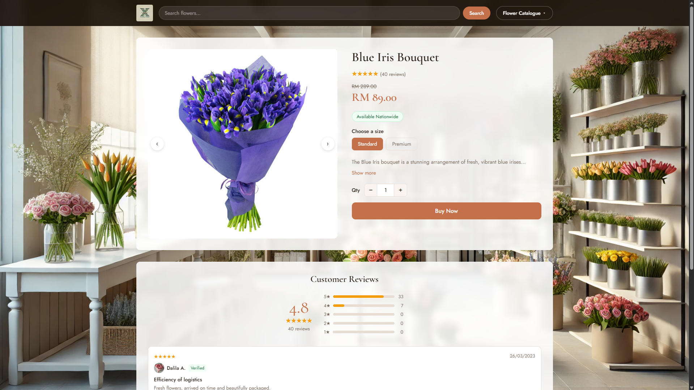
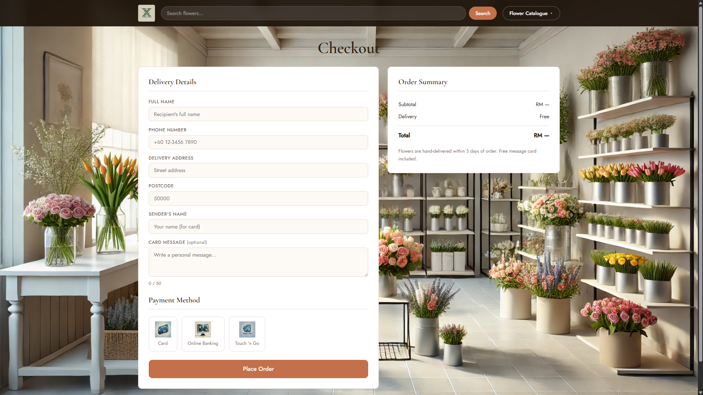

# 🌸 XX Flower Shop


> Your documentation is a direct reflection of your software, so hold it to the same standards.

XX Flower Shop is a responsive e-commerce front-end for an online flower shop based in Malaysia. It covers a complete user journey — from browsing the catalogue by occasion, through to product selection and checkout. Built as a portfolio project to demonstrate front-end fundamentals: semantic HTML, CSS layout systems, responsive design, and vanilla JavaScript DOM manipulation.

---

## 🌟 Highlights

- Browse bouquets by occasion — Birthday, Valentine's Day, Mother's Day, Father's Day, Teacher's Day
- Product pages with image carousel, standard/premium size selector, and live price updates
- Full checkout flow with client-side form validation and payment method selection
- Unified design system across every page — shared nav, footer, fonts, and colour tokens via `base.css`
- No frameworks, no dependencies, no build step — pure HTML, CSS and JavaScript

---

## ✍️ Authors

**Azat Kabulov** — front-end developer based in Kuala Lumpur.
[github.com/AzatKabulov](https://github.com/AzatKabulov)

---

## 🚀 Quick Start

Clone and open:

```bash
git clone https://github.com/AzatKabulov/Online-Flower-Shop.git
cd Online-Flower-Shop
open index.html
```

No install step, no environment variables, no build command. Works in any modern browser.

Or view the live demo directly:
**[AzatKabulov.github.io/Online-Flower-Shop](https://AzatKabulov.github.io/Online-Flower-Shop/)**

---

## 📁 Repository Structure

```
Online-Flower-Shop/
│
├── index.html                    # Homepage
│
├── css/
│   ├── base.css                  # Shared design system (nav, footer, colour tokens)
│   ├── home.css                  # Homepage-specific styles
│   ├── flower.css                # Product page styles
│   ├── fourflowercategories.css  # Occasion/category page styles
│   ├── contact.css               # Contact page styles
│   ├── signuporlogin.css         # Auth page styles
│   └── customerinfo.css          # Checkout page styles
│
├── js/
│   ├── base.js                   # Shared behaviour (search, dropdown)
│   ├── home.js                   # Homepage (carousel, read more, feedback form)
│   ├── flower.js                 # Product pages (image swap, price update, quantity)
│   ├── fourflowercategories.js   # Category pages (hover image swap)
│   ├── signuporlogin.js          # Tab switcher, form handling
│   ├── customerinfo.js           # Checkout form validation
│   └── contact.js                # Contact page
│
├── images/                       # All image assets
│
└── pages/                        # All pages except homepage
    ├── blueiris.html
    ├── redroses.html
    ├── pinklilies.html
    ├── pinktulips.html
    ├── pinkcarnation.html
    ├── pinkroses.html
    ├── daisies.html
    ├── milan.html
    ├── whiteroses.html
    ├── sparklelilies.html
    ├── birthdayflower.html
    ├── fathersdayflower.html
    ├── mothersdayflower.html
    ├── valentinesdayflower.html
    ├── teachersdayflower.html
    ├── contact.html
    ├── signuporlogin.html
    └── customerinfo.html
```

---

## 🗺️ User Journey

```
Homepage
   └── Flower Catalogue (by occasion)
         └── Product Page (carousel · size · price · reviews)
               └── Checkout (delivery details · payment)
                     └── Order Confirmed ✓
```

---

## 📸 Screenshots



> 
